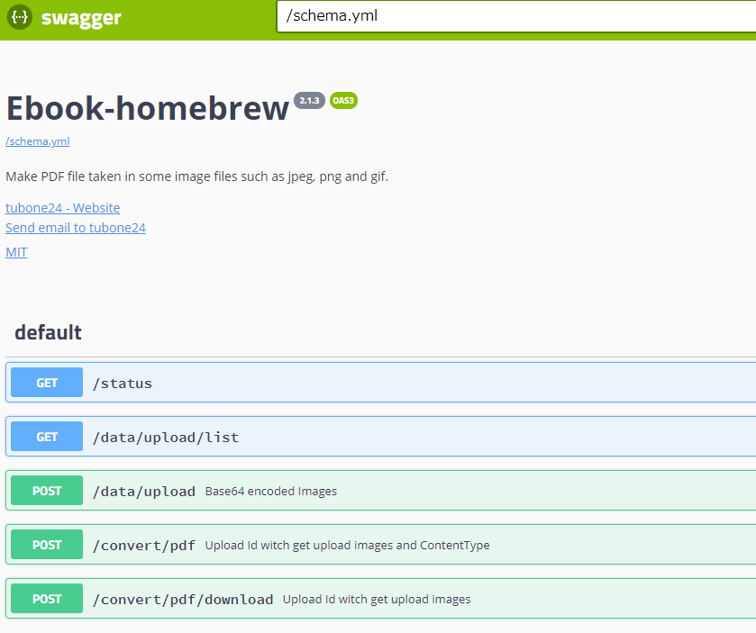
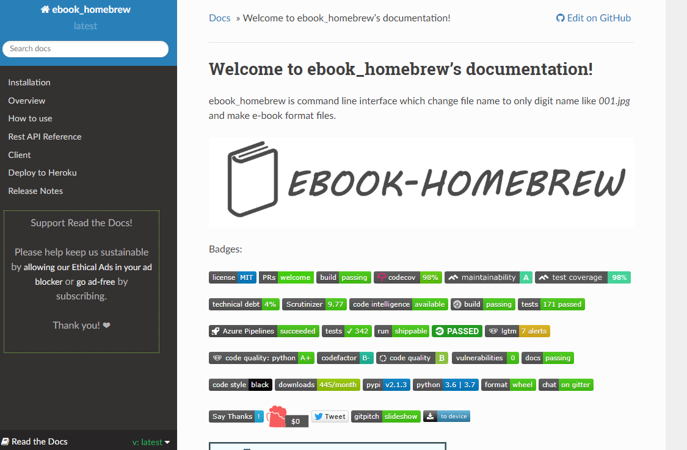
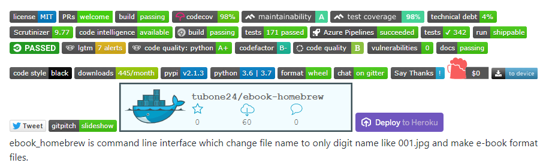
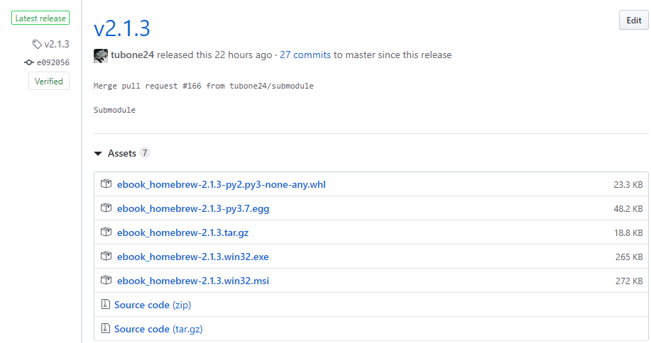
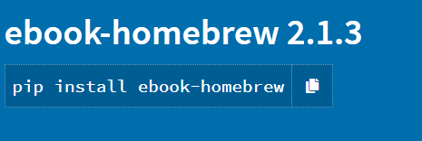
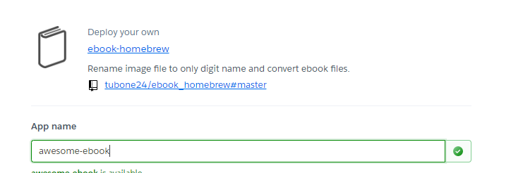

# Ebook Homebrew

---

## What is Ebook Homebrew?

Ebook homebrew is ...

---?color=#FF9000

### My Studies

This repo is my Python and more languages studies materials.

---

## ～2018

First commits, Ebook homebrew is changing file name 
to only digit name like 001.jpg and make e-book format files.

Command Line tool to make with `Python`.

---?color=#FF9000

### Features

@ul[list-square-bullets list-spaced-bullets](false)
- Rename file to only digit name like `001.jpg`
- Convert Image to PDF
- Make Zip
@ulend

Examples..

---

```bash
$ ebookhomebrew auto -s ./tests -d 3,4 -e jpg -f test.pdf
```

---

## Think about..

@img[clip-img clean-img span-20](assets/gitpitch/img/author.png)

@quote[I want to learn more!](tubone)

---?color=#FF9000

## Now..

---

### Evolution

- Awesome REST API with Open API
- Read The Docs
- Perfect Tests(UT/IT/E2E)
- CI/CD
- PyPI
- Heroku
- **More Client**

---?color=#FF3F80

### Awesome REST API

[DEMO SITE](https://ebook-homebrew.herokuapp.com/#/)



---?color=#B867C6

### Read The Docs

[Make Docs, Read the docs](https://ebook-homebrew.readthedocs.io/en/latest/)



---

### Perfect Tests

Perfect Test with Pytest.

Awesome test! coverage 98%! Write UT and IT.


---?color=#02A8F4

### CI/CD

Many Badges!!



---

#### And AutoDeploy!

Auto Deploy using CI/CD



---

### PyPI

Auto Deploy PyPI with CI/CD

`pip install ebook-homebrew`



---?color=#B867C6

### Heroku

Heroku Deploy!



---?color=#FF9000

### More Client

- Flutter (Android & iOS App)
- Nim Client
- Rust Client
- Vue Client

---

### Flutter


---

### Vue Client


---?image=assets/gitpitch/img/journey.jpg

@snap[silver-fox text-italics]
Ebook Homebrew's journey is not over yet..
@snapend
