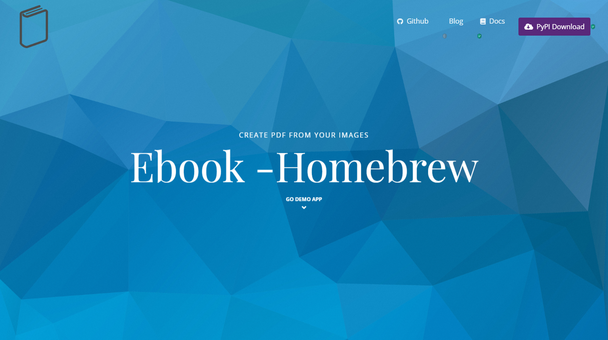
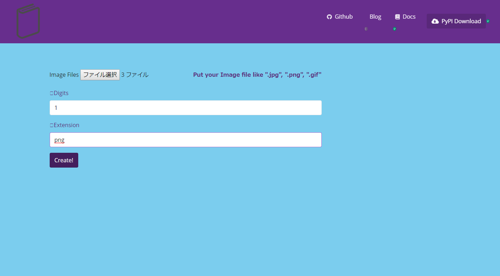
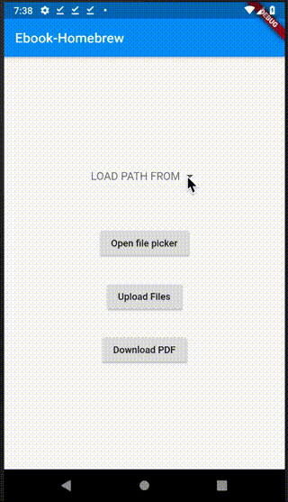

Client
======

Example Client App
------------------

You can use Ebook Homebrew Rest API for example client app.

.. note::

    Examples App use ebook-homebrew demo heroku endpoint.
    If you use your own server, fork the code and change the backend URL.

Git clone Example app with :command:`git clone `::

    $ git clone https://github.com/tubone24/ebook_homebrew.git
    $ git submodule update --init --recursive

Stand Alone Web GUI
^^^^^^^^^^^^^^^^^^^

The basic WEB app which create PDF from your images built in the ebook-homebrew.

Install **Flask** and Execute commands below. ::

  $ cd examples/web_gui/
  $ pip install requirements.txt
  $ cd src
  $ python application.py

And Access `localhost:8080 <http://localhost:8080>`_

You can see The TOP page like blow. Click **GO DEMO APP**

Choose Files, digits and extension. Click **Create!** and Downloading **result.pdf**

Command Line Tools with using Rest API
^^^^^^^^^^^^^^^^^^^^^^^^^^^^^^^^^^^^^^

Client App with ebook-homebrew's rest API interface.
Install **requests** and **docopt** and Execute. ::

  $ cd examples/use_rest_api/
  $ pip install requirements.txt
  $ cd src
  $ python main.py -h

You can see the CLI's Usage.

Android App
^^^^^^^^^^^

.. warning:: This app is created flutter, so you can build an Android app and an iOS app,
but I don't try to build ios app, because I don't have ios.

Demo client Native App for using ebook-homebrew.

Install Flutter SDK and Build App::

  $ cd examples/ebook-homebrew-android-app
  $ git clone -b beta https://github.com/flutter/flutter.git ~/flutter
  $ cat YOUR_APP_KEY > android/app/apk_key.jks
  $ cat YOUR_APP_PROPS > android/key.properties
  $ ~/flutter/bin/flutter build apk --release --split-per-abi

.. image:: https://dply.me/yv0jty/button/large
   :target: https://dply.me/yv0jty#install
   :alt: Try it on your device via DeployGate

Or Download `Google Play <https://play.google.com/store/apps/details?id=com.tubone.ebook_homebrew_flutter>`_

Run App and Enjoy!

Web Front App (Vue.js)
^^^^^^^^^^^^^^^^^^^^^^

.. warning:: ebook-homebrew-vue-client is Deprecated instead of ebook-homebrew-vue-typescript-client

If you want to use Web Front App, you can make reference of Example app building for Vue.js.

You can see 2 examples, **Vue.js with Javascript** or **Vue.js with Typescript**

`Vue.js with Javascript <https://github.com/tubone24/ebook-homebrew-vue-client>`_

`Vue.js with Typescript <https://github.com/tubone24/ebook-homebrew-vue-typescript-client>`_

Install Node.js and NPM and Execute it::

  $ cd examples/ebook-homebrew-vue-typescript-client
  $ npm install
  $ npm run serve

Run App and Enjoy!

Command Line Tool using Rust
^^^^^^^^^^^^^^^^^^^^^^^^^^^^

If you want to use more speedy CLI, Use Rust CLI

Install **Rust** and Execute commands below. ::

  $ cd examples/ebook-homebrew-rust-client/
  $ cargo run
  $ cd target/debug
  $ ./ebook-homebrew-rust-client -h

  ebook_homebrew_rust_client 0.1.0
  tubone24 <tubo.yyyuuu@gmail.com>
  Ebook-homebrew Command Line Tools

  USAGE:
      ebook-homebrew-rust-client.exe [SUBCOMMAND]

  FLAGS:
      -v, --version    CLI version
      -h, --help       Prints help information

  SUBCOMMANDS:
      status      check server status
      upload      upload image files
      convert     convert image files to PDF
      download    download converted PDF file
      help        Prints this message or the help of the given subcommand(s)
